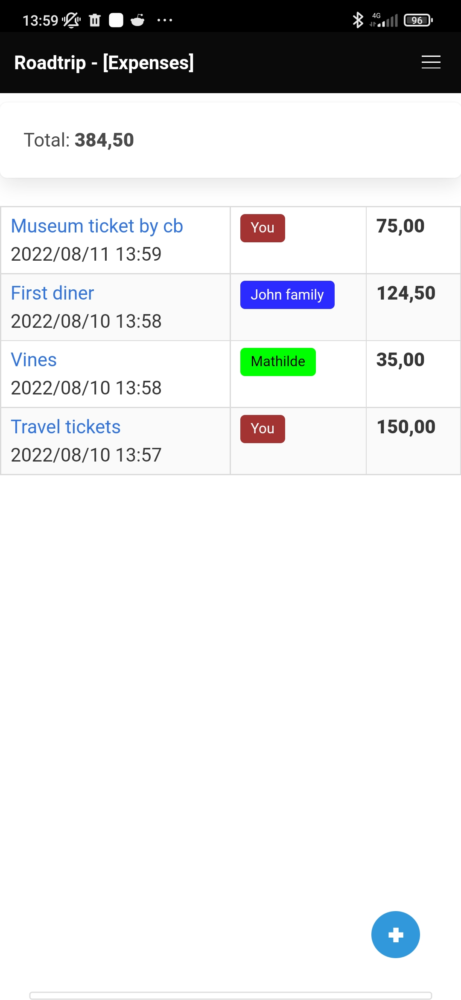
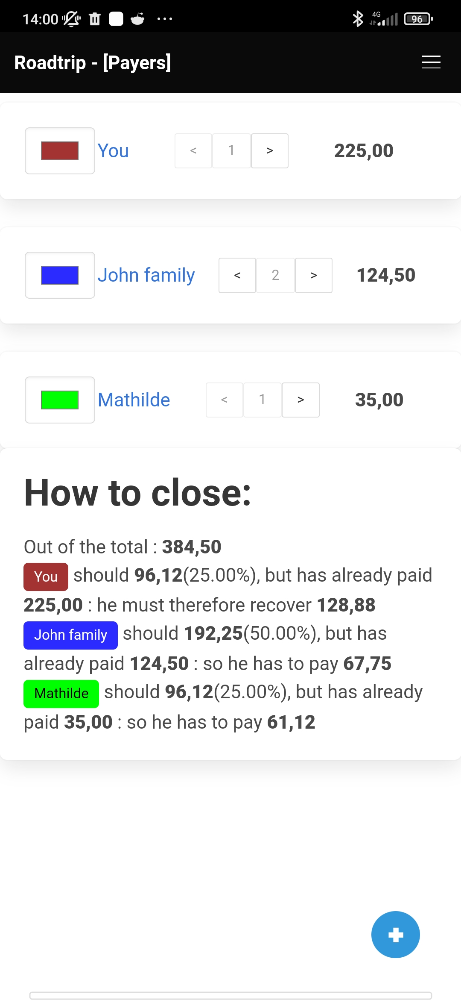

# TriApp (tricount android clone)

With python3's [htag](https://github.com/manatlan/htag) module.

Android's Apk built thru the [htagapk recipe](https://github.com/manatlan/htagapk)

Build the APK using "Actions > Build Apk > Run workflow", the package.zip(apk) is available after 12-to-13 minutes in the resulted process ;-)

## Features

 - easy access : auto re-open last opened trip
 - ability to make fair re-distribution (ability to ponderate "parts" for a payer)
 - more readable : ability to choose a color for a Payer
 - live view for closing the expenses
 
## Screenshots

|------|------|------|
|  |  | |
